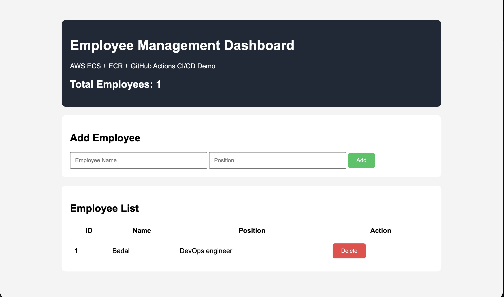
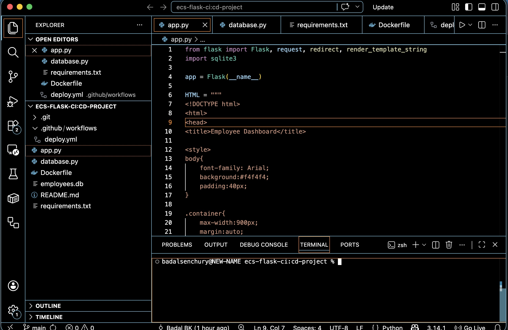
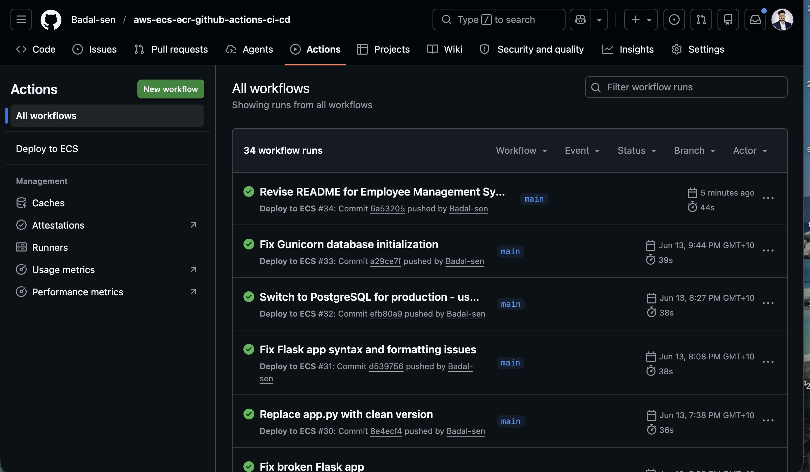
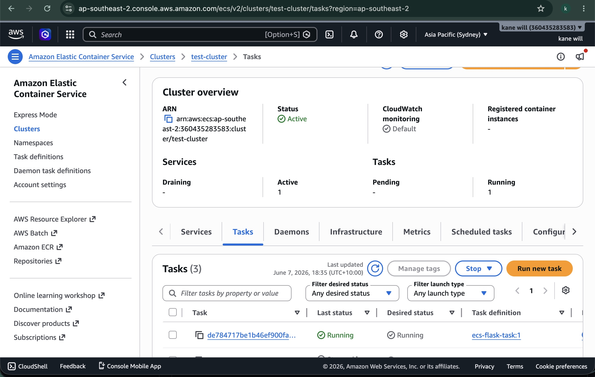

# AWS ECS + ECR + GitHub Actions CI/CD Project

A complete DevOps project demonstrating automated container deployment to AWS using Docker, Amazon ECR, Amazon ECS Fargate, and GitHub Actions.

This project deploys a Flask-based Employee Management Dashboard with SQLite database support through a fully automated CI/CD pipeline.

---

## Project Overview

This project demonstrates:

- Flask web application development
- SQLite database integration
- Docker containerization
- Amazon Elastic Container Registry (ECR)
- Amazon Elastic Container Service (ECS Fargate)
- GitHub Actions CI/CD automation
- Continuous deployment to AWS

---

## Architecture

```text
Developer
    │
    ▼
GitHub Repository
    │
    ▼
GitHub Actions
    │
    ▼
Docker Build
    │
    ▼
Amazon ECR
    │
    ▼
Amazon ECS Fargate
    │
    ▼
Running Web Application
```

---

## Technologies Used

| Technology | Purpose |
|------------|----------|
| Python | Backend |
| Flask | Web Framework |
| SQLite | Database |
| Docker | Containerization |
| GitHub Actions | CI/CD |
| Amazon ECS | Container Orchestration |
| Amazon ECR | Image Registry |
| AWS IAM | Security & Permissions |

---

## Features

- Add Employees
- Delete Employees
- Employee Dashboard
- SQLite Database Storage
- Dockerized Application
- Automated Deployment Pipeline
- AWS Cloud Deployment

---

## Project Structure

```text
aws-ecs-ecr-github-actions-ci-cd/
│
├── .github/
│   └── workflows/
│       └── deploy.yml
│
├── app.py
├── database.py
├── employees.db
├── Dockerfile
├── requirements.txt
├── README.md
│
└── screenshots/
    ├── app-dashboard.png
    ├── source-code.png
    ├── github-actions.png
    ├── ecr-repository.png
    └── ecs-running-task.png
```

---

## CI/CD Workflow

1. Developer pushes code to GitHub
2. GitHub Actions workflow starts automatically
3. Docker image is built
4. Image is pushed to Amazon ECR
5. ECS service is updated
6. New application version is deployed automatically

---

## Screenshots

### Application Dashboard



### Source Code



### GitHub Actions Workflow



### Amazon ECR Repository


### Amazon ECS Running Task



---

## Running Locally

### Clone Repository

```bash
git clone https://github.com/Badal-sen/aws-ecs-ecr-github-actions-ci-cd.git
cd aws-ecs-ecr-github-actions-ci-cd
```

### Install Dependencies

```bash
pip install -r requirements.txt
```

### Run Application

```bash
python app.py
```

Application:

```text
http://localhost:5000
```

---

## Run With Docker

### Build Image

```bash
docker build -t employee-dashboard .
```

### Run Container

```bash
docker run -p 5000:5000 employee-dashboard
```

Application:

```text
http://localhost:5000
```

---

## AWS Services Used

- Amazon ECS Fargate
- Amazon ECR
- AWS IAM
- AWS CloudWatch
- GitHub Actions

---

## DevOps Skills Demonstrated

- Docker
- AWS ECS
- AWS ECR
- CI/CD Pipelines
- GitHub Actions
- Cloud Deployment
- Container Orchestration
- Infrastructure Management

---

## Future Improvements

- PostgreSQL Database
- Terraform Infrastructure as Code
- Application Load Balancer
- Auto Scaling
- HTTPS with ACM
- Monitoring and Alerting
- Blue/Green Deployments

---

## Author

**Badal BK**

Bachelor of Information Technology

Aspiring Cloud & DevOps Engineer

GitHub: https://github.com/Badal-sen

---

## License

This project is intended for educational, learning, and portfolio purposes.
